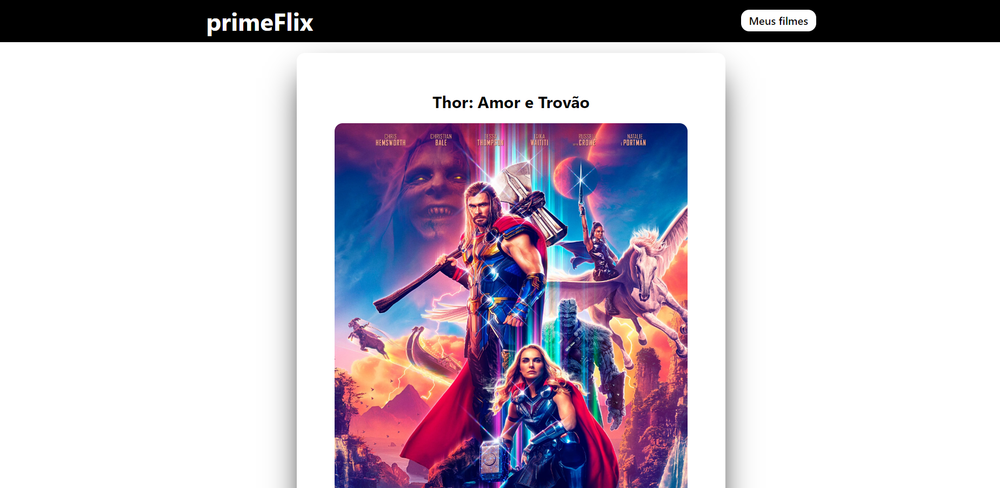

<h1 align="center">
    
</h1>

<h4 align="center"> 
     Projeto/Sie   Concluído!! 	
</h4>

 <a href="#-sobre-o-projeto">Sobre</a> •
 <a href="#-funcionalidades">Funcionalidades</a> •
 <a href="#-layout">Layout</a> • 
 <a href="#-como-executar-o-projeto">Como executar o site</a> • 
 <a href="#-tecnologias">Tecnologias</a> • 
 <a href="#-autor">Autor</a> • 
 <a href="#user-content--licença">Licença</a>

## 💻 Sobre o projeto

O primeFlix é um site que consome uma api do themoviedb
que mostra os 10 filmes mais recentes em
cartaz, com descrição, sinopse e avaliação
além de dar opções de salvar e de ver um
trailer.

---

- [x] ver filmes mais recentes
- [x] consome Api
- [x] salva filmes 
- [x] mostra sinpes dos filmes
- [x] mostra avaliação dos filmes
- [x] Roda tanto no pc quanto tablets e celular
- [x] opção de ver trailer

### Mobile

  

  

  

---

### Web

  

  

  

---

## 🚀 Como executar o projeto/site

basta acessar o o link
[PrimeFlix](https://prime-swart.vercel.app//)

---

## 🛠 Tecnologias

As seguintes ferramentas foram usadas na construção do projeto:

#### **Website**/ ([Html](https://devdocs.io/html//) + [Tailwindcss](https://tailwindcss.com/) + [Js](https://devdocs.Javascript/) + [ReactJs](https://pt-br.reactjs.org/docs/cdn-links.html))

---

## 🦸 Autor

 
<a href="https://github.com/DeyvisonTav">
 
  
  
 <b>Deyvison Tavares</b>🚀</a>
  
  

---

## 📝 Licença

Este projeto esta sobe a licença [MIT](./LICENSE).

Feito com ❤️ por Deyvison Tavares 👋🏽 [Entre em contato!](https://www.linkedin.com/in/deyvison-tavares/)
